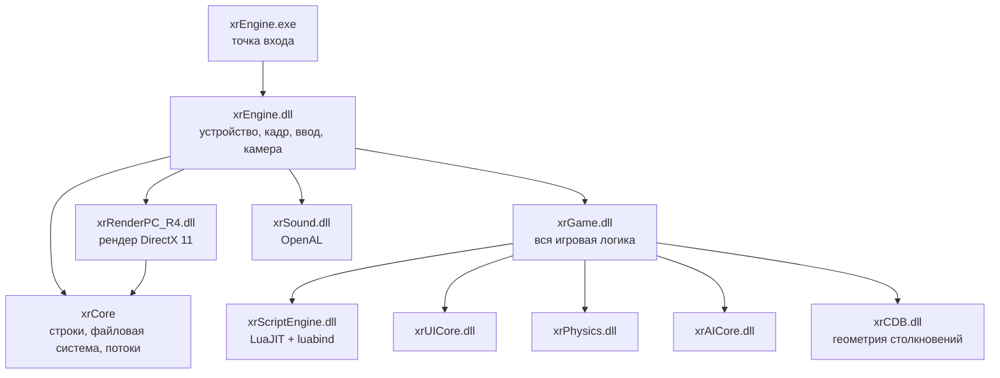
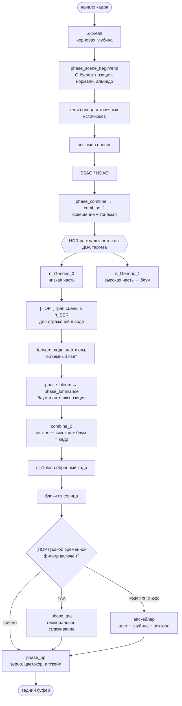
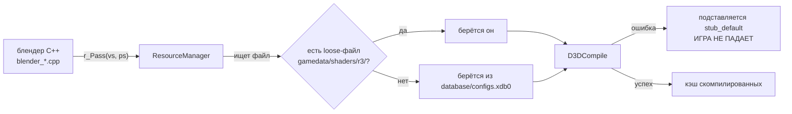
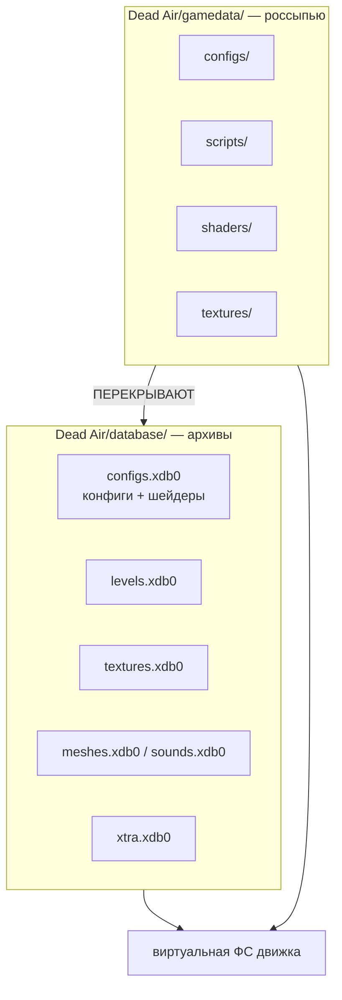

# Архитектура: как устроен порт

Документ для того, кто впервые открыл этот репозиторий. Он отвечает на вопрос «где что лежит и почему
именно так», а не пересказывает исходники — построчные объяснения живут в комментариях рядом с кодом.

## Что это вообще такое

**Dead Air** — мод для S.T.A.L.K.E.R.: Call of Pripyat, форк Call of Chernobyl. Оригинал 32-битный и
работает на рендере R2 (DirectX 9). Этот проект переносит его на **OpenXRay** — открытый 64-битный
форк движка X-Ray с рендером R4 (DirectX 11).

Ключевое разделение, которое определяет всё остальное:

| | Откуда берётся | Кто отвечает |
|---|---|---|
| **Данные** (конфиги, скрипты, модели, текстуры, звук) | из оригинального Dead Air, 1:1 | автор мода |
| **Движок** (C++) | OpenXRay + перенесённые правки DA | этот порт |

Данные **не переписываются**. Если что-то работает не так, как в оригинале, чинится код, а не конфиг.
Это не эстетическое предпочтение: мод продолжает жить своей жизнью, и любая правка данных превратится
в конфликт при следующем обновлении.

## Модули



Рендер грузится **динамически** по выбору в настройках — отсюда `GEnv.Render` и вызовы через интерфейс,
а не напрямую. Практическое следствие: рендер не может звать функции `xrGame` напрямую, только через
`IGame_Persistent` и подобные интерфейсы.

### Где искать что

| Хочу починить | Смотреть в |
|---|---|
| картинку, шейдеры, проходы рендера | `src/Layers/xrRenderPC_R4/`, `src/Layers/xrRender_R2/` (общий код R2/R3/R4), `src/Layers/xrRender/` (совсем общий) |
| порядок кадра, камеру, разрешение, консольные команды `r__*` | `src/xrEngine/` |
| оружие, костюмы, детекторы, зоны, мутантов, инвентарь | `src/xrGame/` |
| окна, меню, HUD | `src/xrGame/ui/`, `src/xrUICore/` |
| то, что видит Lua | `src/xrGame/*_script.cpp`, `src/xrScriptEngine/` |
| ALife: спавн, оффлайн-симуляция, сейвы | `src/xrServerEntities/`, `src/xrGame/alife_*` |

Имена файлов рендера сбивают с толку: `xrRender_R2` — это **не только** старый R2. Там лежит код,
общий для R2/R3/R4, и файлы с префиксом `r3_` собираются в том числе в R4. Проверять по
`CMakeLists.txt` конкретной цели, а не по имени папки.

## Кадр рендера R4

Это самая важная схема в документе: почти все визуальные баги — это «проход сделал не то или не в том
месте». Отмечено, что добавил порт.



**Про вектора движения.** Порт добавил в G-буфер третью цель — смещение каждого пикселя с прошлого
кадра. Её пишут все пути отрисовки геометрии, плюс отдельный проход для неба. Временной фильтр
работает **ровно один**: TAA и апскейлер несовместимы, оба потребляют историю кадра. Разбор —
[09_UPSCALERS.md](09_UPSCALERS.md).

**Ловушка, стоившая целого вечера отладки:** `combine_1` пишет в ДВА таргета, потому что LDR-формат не
вмещает HDR — яркость раскладывается на низкую и высокую части, и они складываются обратно только в
`combine_2`. Любая обработка кадра между этими точками видит **половину** картинки. Темпоральное
сглаживание, поставленное на `rt_Generic_0`, смешивало с историей только низкую часть, пока высокая
оставалась текущей: ошибка росла с яркостью пикселя, небо плыло, земля стояла, а граница между ними
ползла по экрану полосой. Правило: **обработка всего кадра ставится после `combine_2`.**

Второй мелкий, но дорогой факт: `u_setrt(ref_rt …)` записывает размеры цели, но **не** трогает вьюпорт.
Проходы полагаются на вьюпорт, унаследованный от предыдущего. Попытка «починить» это глобально ломает
авто-экспозицию: замер яркости рисует квадрат размером с блум в цель 64×64 и рассчитывает именно на
чужой вьюпорт.

## Как устроены шейдеры



Три вещи, которые надо знать до того, как трогать шейдер:

1. **Шейдеры лежат в `database/configs.xdb0` несжатыми.** Конфиги в том же архиве сжаты, а шейдеры —
   нет, поэтому их можно искать побайтово. Копий каждого шейдера **две**: DX9 (ближе к началу файла) и
   DX11 (дальше). Взять не ту — получить бирюзовую воду и сломанную глубину. Признаки DX11-копии:
   `SV_Target`, `Texture2D`, `.Sample(smp_…)`.
2. **«shader is missing» в логе часто означает ошибку компиляции, а не отсутствие файла.** Движок молча
   подставляет заглушку, и сцена выглядит «почти правильно». Рабочий шейдер — это тысячи байт в кэше,
   заглушка — сотни.
3. **Текстуры в блендере привязываются через `r_dx11Texture`, а не `r_Sampler_*`.** В DX11 текстура и
   сэмплер — разные объекты с разными именами. Штатные блендеры выживают с `r_Sampler_*` только потому,
   что их шейдеры движок вынужден перекомпилировать в режиме совместимости с DX9 (они падают на
   ошибке X3523), а там компилятор создаёт пару «текстура+сэмплер» под одним именем. Свежий шейдер такой
   пары не даёт, и `r_Sampler_*` роняет игру проверкой типа константы.

## Данные



Файл россыпью всегда перекрывает архивный. Так сделаны все правки шейдеров и интерфейса в этом
порте — архивы остаются нетронутыми, и мод можно обновить, не потеряв наработки.

**Важно про извлечённые данные:** в `extracted/` лежит распакованный контент, но часть файлов там —
**устаревшие ревизии**. Скрипт интерфейса оттуда оказался на 1600 байт короче настоящего, а XML —
без целой вкладки. Настоящее содержимое достаётся только через саму игру (консольная команда
`da_dump_ui_xml` выгружает файлы через виртуальную ФС движка так, как их видит движок). Правило:
**для правок брать дампы из `appdata/logs/vfs_*`, а не из `extracted/`.**

## Сборка

```bash
bash _build_fast.sh xrRenderPC_R4
```

Быстрая сборка одной цели: `ccache` + `-Og` + выключенный LTO, около 6 секунд против 15 минут у
полной. Цели: `xrEngine`, `xrGame`, `xrRenderPC_R4`, `xrUICore`, `xrSound`, `xrCore`.

Полная пересборка:

```bash
cd xray-16/build_mingw && cmake --build . -j8
```

**Правило, оплаченное сломанной сборкой:** правка общего заголовка (`Device.h` и подобных) требует
пересборки **всего**. Иначе часть модулей останется с прежним представлением о размере класса — игра
соберётся, запустится и упадёт в неожиданном месте. Симптомы были такие: чёрное меню, падения в
реестре сообщений, затем полный отказ запуска.

Готовые библиотеки копируются в `Dead Air/bin/`. Игра при этом должна быть закрыта.

⚠️ **Два набора библиотек.** В `Dead Air/bin` развёрнута смесь: 6 перф-критичных библиотек собраны
релизной сборкой (`-O3 + LTO`), остальные быстрой. Копировать надо **только правленое** — массовое
копирование быстрого набора поверх релизного уронило частоту с 242 до 130 fps. Разница в размере
файлов между наборами нормальна.

⛔ **Релизную сборку без выпуска не запускать.** Прерванная оставляет библиотеки нулевого размера, а
`ninja` потом отвечает «finished 0s» и врёт, что всё собрано. Цели под OpenGL не собираются и не
нужны — порт идёт только на DX11 R4.
