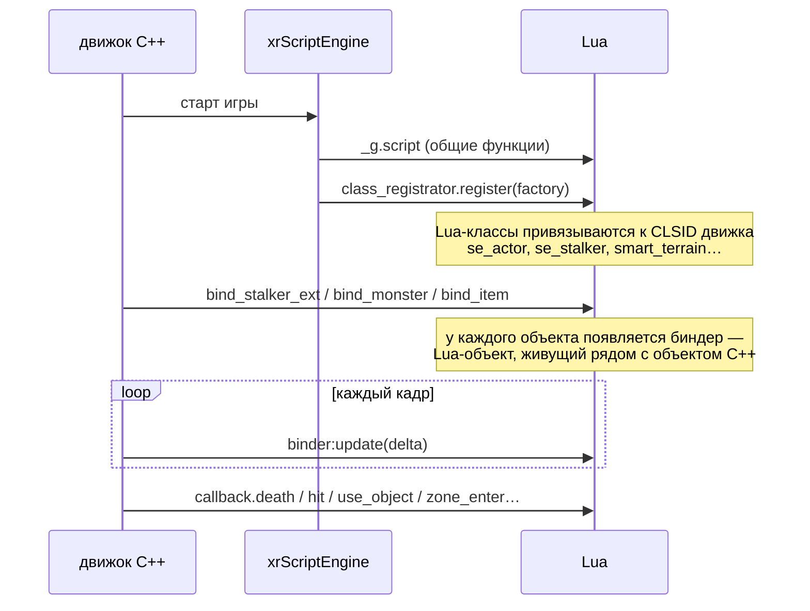
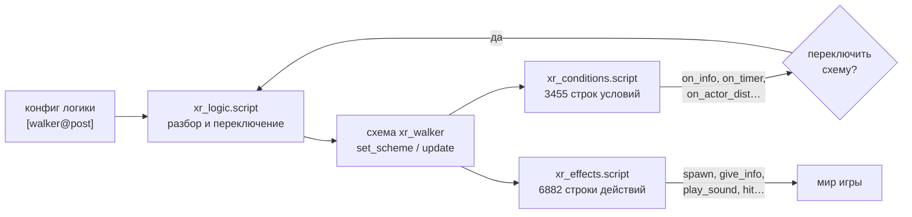
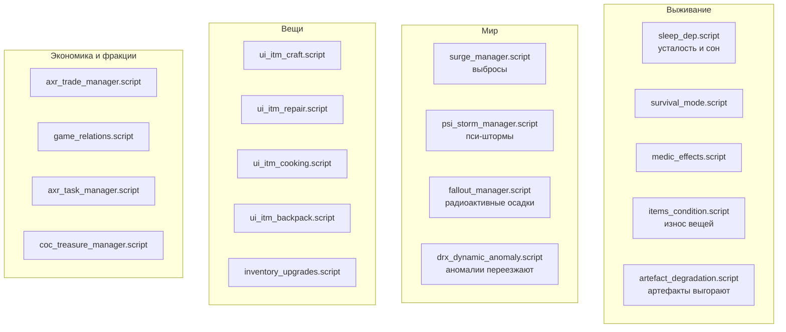
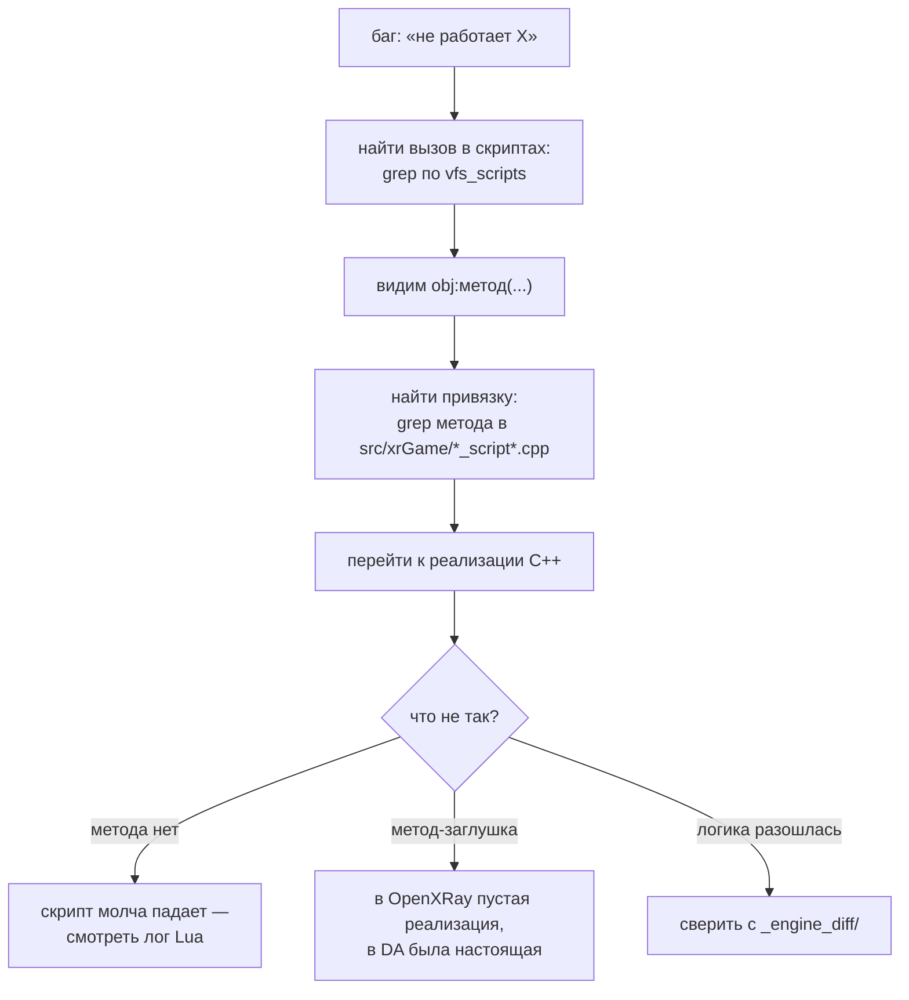

# Карта Lua: скрипты, схемы, мост в движок

**378 скриптов** составляют почти всю игровую логику Dead Air. Движок для них — исполнитель:
он даёт объекты, события и примитивы, а решения принимает Lua. Поэтому большинство «багов игры»
чинятся не там, где проявляются.

> Оговорка про сравнение с базой. В репозитории `CoC-Xray/` лежат только 37 скриптов — это неполный
> набор Call of Chernobyl, остальные у него в архивах. Механическое сравнение даёт «342 скрипта только
> в DA», и **это неверный вывод**: большинство из них — обычные скрипты CoC, просто отсутствующие в
> git-репозитории движка. Достоверно отделить авторские фичи от базовых можно только сравнением с
> распакованными архивами самого CoC. Записано как вопрос в `06_QUESTIONS.md`.

## Где лежат скрипты

| Место | Что там | Когда использовать |
|---|---|---|
| `Dead Air/database/configs.xdb0` | все 378, сжатые | штатная работа игры |
| `Dead Air/appdata/logs/vfs_scripts/` | дамп всех 378 через ФС движка | **читать отсюда** |
| `Dead Air/gamedata/scripts/` | 39 файлов россыпью | наши правки, перекрывают архив |
| `extracted/` | распакованное | **не использовать**, там устаревшие ревизии |

> **Исключение из правила «данные 1:1».** Несколько скриптов всё же форкнуты россыпью — там, где
> падение приходило из самого Lua и починить его из движка было нельзя. Самый крупный случай:
> `xr_conditions.script` (3455 строк) с шестью защитами от `nil`, из-за которых игра падала при
> загрузке уровня. Каждый такой форк — сознательное решение, а не забывчивость; при обновлении мода
> их надо пересобрать поверх новой версии.

## Как движок запускает Lua

Две точки входа, с которых стоит начинать любое расследование:

- **`class_registrator.script`** — таблица соответствий «класс движка ↔ класс Lua». Если объект ведёт
  себя не так, сначала сюда: возможно, за него отвечает вообще другой скрипт, чем кажется.
- **`modules.script`** — список из **70 схем поведения**. Каждая схема это набор «условия → действия»,
  которые вешаются на NPC, мутанта, предмет или зону через конфиг логики.

## Схемы поведения

`LoadScheme("xr_walker", "walker", stype_stalker)` означает: файл `xr_walker.script` обслуживает секцию
логики `walker`, применимую к сталкерам. В конфиге логики уровня пишется `[walker@post]`, и схема
подхватывается.

Группы схем по типу объекта:

| Префикс | Кол-во | Для чего |
|---|---|---|
| `xr_*` | 47 | базовые схемы сталкеров: бой, ходьба, сон, лагерь, ранение, диалоги |
| `mob_*` | 11 | мутанты: бой, прыжок, дом, смерть, торговля |
| `ph_*` | 12 | физические объекты: двери, машины, кнопки, миниган |
| `sr_*` | 14 | зоны-рестрикторы: телепорт, тишина, постпроцесс, спавн ворон |
| `smart_*` | 62 | смарт-террейны и укрытия (в основном описания анимаций) |
| `axr_*` | 18 | наработки Alundaio: компаньоны, задания, торговля, перегрев |
| `se_*` | 12 | серверные (оффлайн) сущности ALife |
| `sim_*` | 8 | симуляция: отряды, фракции, захват территорий |
| `ui_*` | 34 | интерфейс: крафт, ремонт, рюкзак, сон, PDA |
| `dialogs*` | 11 | диалоги, по уровням |

## Ключевые подсистемы Dead Air

Это то, что делает мод модом. Проверено по коду в ходе портирования.

**Особые режимы:** `azazel_mode.script` — после смерти игрок вселяется в другого сталкера;
`survival_mode.script` — ужесточённые правила. Оба меняют базовые допущения игры, и их стоит проверять
отдельно при любой правке смерти, спавна или инвентаря.

## Мост Lua ↔ C++: как искать баг

Это главный рабочий приём, он экономит часы.

Файлы привязок (`src/xrGame/`):

| Файл | Что открывает в Lua |
|---|---|
| `script_game_object*.cpp` | почти все методы игрового объекта |
| `script_game_object_inventory_owner.cpp` | инвентарь, торговля, детекторы, ранги |
| `level_script.cpp` | глобальные функции уровня: погода, время, объекты |
| `alife_simulator_script.cpp` | ALife: спавн, отряды, смарт-террейны |
| `ui_*_script.cpp`, `ScriptXMLInit.cpp` | построение окон из XML |
| `xrServer_Objects_ALife_*_script*.cpp` | серверные сущности |

**Типичная ловушка порта:** в OpenXRay метод существует, но внутри пусто или упрощённо, а в Dead Air за
ним стояла настоящая логика. Скрипт при этом работает «наполовину»: не падает, но эффекта нет.
Так было с переносными источниками света — DA гоняет скрытый факел через `torch_set_*`, а в порте
эти методы оказались заглушками.

## Callbacks: как движок дёргает Lua

Самые используемые (по частоте в скриптах):

| Callback | Раз | Где чаще всего |
|---|---|---|
| `use_object` | 29 | нажатие «использовать» на объекте |
| `death` | 14 | смерть NPC/мутанта |
| `hit` | 12 | попадание |
| `begin` | 8 | начало анимации/действия |
| `sound` | 6 | услышанный звук |
| `zone_enter` / `zone_exit` | 8 | вход и выход из аномалии |
| `on_item_take` / `on_item_drop` | 6 | предметы в инвентаре |

Если callback не приходит — проверять, вызывает ли его C++: часть вызовов в OpenXRay расположена в
других местах кадра, чем в оригинале, а часть просто отсутствует.

## Отладка Lua

- `xrs_debug_tools.script`, `ui_debug_main.script`, `debug_cmd_list.script` — отладочные средства,
  встроенные в мод. **2084 строки** списка команд.
- `lua_help.script` (12041 строка) — сгенерированный справочник всех привязок. Устаревает, но как
  ориентир по именам методов полезен.
- `profiler.script` — встроенный профилировщик Lua. Не проверялся в ходе портирования; кандидат на
  использование при жалобах на просадки, потому что подтормаживания в X-Ray чаще скриптовые, чем
  графические.
