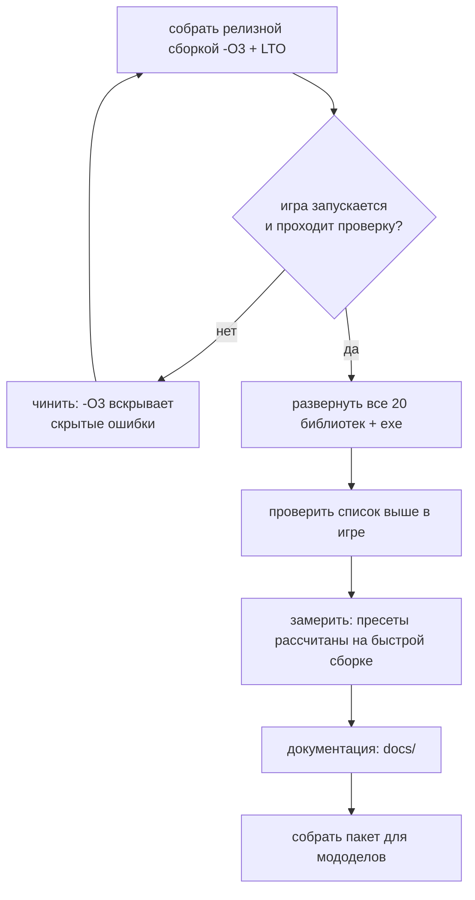

# Дорожная карта

Ориентир по релизу для мододелов — **10 августа**. Документ отражает состояние на 29 июля.

## Где мы сейчас

```mermaid
gantt
    dateFormat YYYY-MM-DD
    title Путь порта
    section Основание
    Разбор оригинала (декомпиляция, извлечение данных)  :done, a1, 2026-06-01, 2026-07-05
    Исходники DA от автора, дифф движка                 :done, a2, 2026-07-05, 2026-07-12
    section Перенос
    Правки движка из диффа                              :done, b1, 2026-07-12, 2026-07-20
    Инвентарь, детекторы, зоны, мутанты                 :done, b2, 2026-07-18, 2026-07-24
    section Картинка
    Отражения в воде, вид воды                          :done, c1, 2026-07-20, 2026-07-25
    Масштаб рендера, темпоральное сглаживание           :done, c2, 2026-07-24, 2026-07-26
    Векторы движения, FSR 2/3, XeSS                     :done, c3, 2026-07-25, 2026-07-27
    DLSS: прослойка MinGW, векторы мира                 :done, c4, 2026-07-28, 2026-07-29
    section Скорость
    Замеры кадра, потолок теней, поиск пути             :done, e1, 2026-07-27, 2026-07-28
    Меню производительности и пресеты                   :done, e2, 2026-07-28, 2026-07-28
    section Осталось
    Проверка в игре всего перенесённого                 :active, d1, 2026-07-26, 2026-08-03
    Сборка релиза и документация                        :d3, 2026-08-03, 2026-08-10
```

## Сделано

**Основание.** Оригинал разобран: движок декомпилирован (16 модулей, ~51 тысяча функций), данные
извлечены и разложены, распаковщик архивов написан. Затем автор мода передал исходники x64-альфы и
базы Call of Chernobyl — появился настоящий дифф движковых правок вместо чтения декомпилята.
Отчёт-карта: `_engine_diff/DA_ENGINE_CHANGES.md`.

**Перенос.** 920 правок в 199 файлах — полный список в `02_PORT_CHANGES.md`. Крупное: слоты инвентаря
(рюкзак и граната), детекторы и счётчик Гейгера, зоны, снорк, защита костюмов и шлемов, торговля,
переносные источники света (все четыре, включая керосинку), звук, меню настроек, система состояния
актёра (выносливость, сытость, лечение, вес снаряжения), КПК (отношения и статистика), инвентарь.

**Картинка.** Экранные отражения в воде, вид воды доведён и принят, масштаб внутреннего рендера с
бикубическим апскейлом, темпоральное сглаживание, **векторы движения для всей геометрии** включая
скелетную анимацию, и на них — FSR 2, FSR 3, XeSS и **DLSS**. Подробности и ограничения:
`09_UPSCALERS.md`.

**Скорость.** Разобран кадр по фазам, найдены и закрыты три крупных источника тормозов: шторм поиска
пути у сталкеров (75 → 531 fps), отсутствие потолка теневых источников (в баре 9.65 → 3.75 мс),
дальность каскадов солнца (на Кордоне 130 → 240–500 fps). Сделаны вкладка «Производительность» и
общие пресеты. Цифры и метод: `04_PERFORMANCE.md`.

**Инструменты.** Быстрая сборка (6 с вместо 15 мин), собственные замеры кадра (`da_perf_dump`,
`da_gpu_log`, `da_render_log`), выгрузка интерфейсных файлов через ФС движка, переключатель сезонов.

## Осталось

### Обязательно до релиза

| Задача | Почему | Риск |
|---|---|---|
| **Проверить в игре перенесённое** | часть правок из движкового диффа и игровых изменений не проверялась живьём | высокий: чинили вслепую |
| **Собрать релиз целиком с `-O3 + LTO`** | сейчас развёрнут смешанный набор: 6 перф-критичных библиотек релизные, остальные быстрые | средний: `-O3` может вскрыть скрытые ошибки |
| **Прогнать сохранения** | маска поломок оружия не сериализуется; починка ломает старые сейвы, решать до выпуска, а не после | средний |

Список того, что надо потыкать руками (не проверено в игре):

- память неба, осечки оружия, поведение сталкеров, свет полтергейста, звуки усталости и попаданий,
  бег в прицеливании, звук двигателя;
- защита от радиации после уменьшения в 10 раз;
- гейгер (когда трещит, когда молчит);
- капли на визоре в дождь;
- снорк: анимации и поведение;
- шесть правок системы состояния актёра (сытость, бустеры, ожоги, раны) — перенесены и трижды сверены
  по коду, но живьём не игрались;
- защита реестра ALife от повторной регистрации при смене уровня.

**Проверено и закрыто:** фонарь, палочка, зажигалка, керосинка; граната в 14-м слоте и рюкзак в 15-м;
вес снаряжения; FSR 2 в игре; потолок теневых ламп.

### Желательно

- профиль Tracy на слабой машине;
- `profiler.script` на предмет скриптовых подтормаживаний;
- батарейная фича: у автора артефакты работают только при наличии батареи в слоте, в порте нет ни
  `m_bUseEnergy`, ни `BATTERY_SLOT` — артефакты работают всегда. В данных DA ключ `use_energy` не
  встречается ни разу, так что поведение и у автора то же самое: переносить только вместе со всей
  механикой батарей;
- **дрожь растительности** и **плетение детальной текстуры под FSR 2** — два известных визуальных
  дефекта, круг причин сужен замерами, но не закрыт (`10_DEBUG_DETAIL_WEAVE.md`);
- **мерцание земли под острым углом** при включённой реконструкции — главный незакрытый дефект,
  разбор и список уже отпавших версий в `09_UPSCALERS.md`.

### Сознательно отложено

- **рефракция воды** — требует переделки того, как вода накладывается на сцену; предложена и отклонена;
- **расширение многопоточности** — риск гонок данных у игроков перевешивает выигрыш до релиза;
- **сериализация маски поломок оружия** — DA пишет её в пакет, порт нет, поломки живут одну сессию.
  Починка меняет формат сейва, поэтому только вместе с решением по совместимости.

## Как выпускать



⚠️ На выпуск идёт **целиком релизная** сборка — это единственный момент, когда наборы не смешиваются.
Пресеты производительности калибровались на смешанном наборе, так что после полного релиза их стоит
перепроверить: числа могут сдвинуться в лучшую сторону.

**Про развёртывание:** правка общего заголовка требует пересборки всего и копирования **всех**
библиотек. Частичное обновление даёт падения в неожиданных местах, потому что часть модулей остаётся
со старым представлением о размере класса. Это уже случалось.
