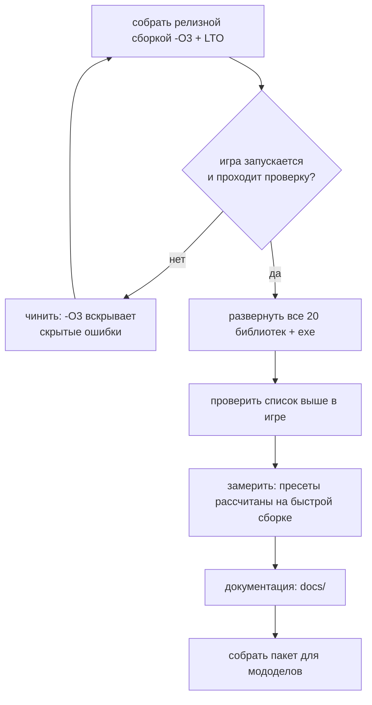

# Дорожная карта

Ориентир по релизу для мододелов — **10 августа**. Документ отражает состояние на 30 июля.

## Где мы сейчас

```mermaid
gantt
    dateFormat YYYY-MM-DD
    title Путь порта
    section Основание
    Разбор оригинала (декомпиляция, извлечение данных)  :done, a1, 2026-06-01, 2026-07-05
    Исходники DA от автора, дифф движка                 :done, a2, 2026-07-05, 2026-07-12
    section Перенос
    Правки движка из диффа                              :done, b1, 2026-07-12, 2026-07-20
    Инвентарь, детекторы, зоны, мутанты                 :done, b2, 2026-07-18, 2026-07-24
    section Картинка
    Отражения в воде, вид воды                          :done, c1, 2026-07-20, 2026-07-25
    Масштаб рендера, темпоральное сглаживание           :done, c2, 2026-07-24, 2026-07-26
    Векторы движения, FSR 2/3, XeSS                     :done, c3, 2026-07-25, 2026-07-27
    DLSS: прослойка MinGW, векторы мира                 :done, c4, 2026-07-28, 2026-07-29
    section Скорость
    Замеры кадра, потолок теней, поиск пути             :done, e1, 2026-07-27, 2026-07-28
    Меню производительности и пресеты                   :done, e2, 2026-07-28, 2026-07-28
    section Инструменты
    Авто-тесты Lua-скриптов                             :done, t1, 2026-07-29, 2026-07-29
    section Устойчивость
    Утечки памяти, семь штук                            :done, s1, 2026-07-29, 2026-07-30
    Падения загрузки, Windows 7, мерцание тени          :done, s2, 2026-07-29, 2026-07-30
    section Осталось
    Проверка в игре всего перенесённого                 :active, d1, 2026-07-26, 2026-08-03
    Сборка релиза и документация                        :d3, 2026-08-03, 2026-08-10
```

## Сделано

**Основание.** Оригинал разобран: движок декомпилирован (16 модулей, ~51 тысяча функций), данные
извлечены и разложены, распаковщик архивов написан. Затем автор мода передал исходники x64-альфы и
базы Call of Chernobyl — появился настоящий дифф движковых правок вместо чтения декомпилята.
Отчёт-карта: `_engine_diff/DA_ENGINE_CHANGES.md`.

**Перенос.** 1086 правок в 228 файлах — полный список в `02_PORT_CHANGES.md`. Крупное: слоты инвентаря
(рюкзак и граната), детекторы и счётчик Гейгера, зоны, снорк, защита костюмов и шлемов, торговля,
переносные источники света (все четыре, включая керосинку), звук, меню настроек, система состояния
актёра (выносливость, сытость, лечение, вес снаряжения), КПК (отношения и статистика), инвентарь.

**Картинка.** Экранные отражения в воде, вид воды доведён и принят, масштаб внутреннего рендера с
бикубическим апскейлом, темпоральное сглаживание, **векторы движения для всей геометрии** включая
скелетную анимацию, и на них — FSR 2, FSR 3, XeSS и **DLSS**. Подробности и ограничения:
`09_UPSCALERS.md`.

**Скорость.** Разобран кадр по фазам, найдены и закрыты три крупных источника тормозов: шторм поиска
пути у сталкеров (75 → 531 fps), отсутствие потолка теневых источников (в баре 9.65 → 3.75 мс),
дальность каскадов солнца (на Кордоне 130 → 240–500 fps). Сделаны вкладка «Производительность» и
общие пресеты. Цифры и метод: `04_PERFORMANCE.md`.

**Инструменты.** Быстрая сборка (6 с вместо 15 мин), собственные замеры кадра (`da_perf_dump`,
`da_gpu_log`, `da_render_log`), выгрузка интерфейсных файлов через ФС движка, переключатель сезонов.
С 29 июля — **авто-тесты Lua-скриптов** (`tests/run_tests.py`): разбор всех скриптов тем же LuaJIT,
что в движке, байтовая гигиена, вызовы `level.*` против биндингов порта, настройки без читателя,
unit-тесты на моках и главное — поиск глобалов, которые читаются, но нигде не присваиваются. Именно
эта проверка ловит класс дефекта, из-за которого предупреждения о выбросе молчали годами.

**Устойчивость (29–30 июля).** Отдельная волна работы, которая к переносу отношения не имеет, но без
неё выпускать было нельзя.

Закрыто **семь утечек памяти**, шесть из них — баги самого OpenXRay, а не порта: потерянный сетевой
пакет на каждое событие (это открытый баг upstream #2080), узлы `xr_fixed_map` в графе сцены рендера
(6 ГБ за десять минут игры — текла покадрово), граф ИИ уровня (15.6 МБ на каждую перезагрузку
сохранения), пути патрулей (там же было и двойное освобождение), буфер скриптового движка, объёмы
объёмного тумана и — самая крупная — представления текстур: **800 МБ памяти драйвера за каждую смену
уровня**. Последняя интересна методически: наши инструменты её не видели в принципе, потому что
объекты DirectX не живут в кучах Windows. Метод и цифры — в `07_TROUBLESHOOTING.md`.

Закрыты три падения: **не грузился ни один уровень с водой** (наш цикл экранных отражений
разворачивался компилятором и ронял сам `D3DCompile`, без стека и без сообщения); **Windows 7** — игра
не запускалась вовсе, а после починки падала на первом кадре меню, оба раза из-за кода, который
никогда не исполняется; и ловушка аллокатора, которая роняла игру сама, когда её забывали выключить.

Закрыто **мерцание тени** — последний незакрытый дефект картинки. Причиной оказалась наша же поправка
на джиттер, добавленная против него же днём раньше. Заодно сведены в один путь два способа выдавать
джиттер (из-за расхождения кадр ездил влево-вправо и на нашей темпоралке, и на FSR 3) и убрана дрожь
травы и листвы под апскейлерами — реактивность листвы была завышена на порядок.

## Осталось

### Обязательно до релиза

| Задача | Почему | Риск |
|---|---|---|
| **Проверить в игре перенесённое** | часть правок из движкового диффа и игровых изменений не проверялась живьём | высокий: чинили вслепую |
| **Собрать релиз целиком с `-O3 + LTO`** | сейчас развёрнут смешанный набор: 6 перф-критичных библиотек релизные, остальные быстрые | средний: `-O3` может вскрыть скрытые ошибки |
| **Прогнать сохранения** | смена уровня и уход объектов в офлайн — оба краша реестра ALife чинились вслепую, гварды в игре не гонялись | средний |
| **Пересобрать пакет тестерам** | в `DeadAir_Tester` лежит сборка от 2:00 30 июля, то есть без падения на воде, без утечки представлений текстур и без починенного мерцания | высокий: у тестера не грузился бы ни один уровень с водой |

⚠️ Порядок здесь не произвольный. Пакет собирается **после** полного релизного прогона, потому что
сейчас в игре развёрнут смешанный набор библиотек, а частичное обновление уже давало падения в
неожиданных местах.

Список того, что надо потыкать руками (не проверено в игре):

**Сделано 29 июля, ни разу не игралось** — самое свежее и потому самое рискованное:

- **поломка креплений аддонов** (биты 28/29/30) — глушитель и подствольник не пристегнуть и не
  снять со сломанного крепления, пустое сломанное крепление уходит в «не носит такого». Проверять и
  на регресс: у исправного ствола ячейки аддонов должны остаться на месте;
- **заклинивший переводчик огня** (бит 27) — не переключается, и сама попытка переключения может его
  заклинить тем вероятнее, чем изношенней ствол;
- **предупреждения о выбросе** — радиофразы и сирена; работают только на Затоне, Юпитере и
  Агропроме, на остальных уровнях тишина по данным мода;
- **судьба NPC в выбросе и психошторме** — при значениях по умолчанию поведение прежнее, менять
  только строкой в `atmosfear_options.ltx`.

**Перенесено раньше, живьём не игралось:**

- память неба, поведение сталкеров, свет полтергейста, звуки усталости и попаданий, бег в
  прицеливании, звук двигателя;
- защита от радиации после уменьшения в 10 раз;
- капли на визоре в дождь;
- снорк: анимации и поведение;
- газ в лабораториях (X-18, X-8, X-16, warlab) — единственное место, где защита реально нагружена.

**Гварды реестра ALife — проверены и закрыты 29 июля.** Три смены уровня подряд без единого падения,
на двух из них гварды сработали и предотвратили ровно тот краш, что ронял игру 27 июля: члены
офлайновых отрядов (`sim_default_*`) регистрировались повторно сразу после `- Disconnect`. Каждый
объект зацепил **два** реестра — графовую точку и расписание, — и гвард расписания, поставленный
превентивно, оказался не перестраховкой. Загрузка квиксейва на 27 394 объекта тоже чиста.

**Проверено и закрыто:** фонарь, палочка, зажигалка, керосинка; граната в 14-м слоте и рюкзак в 15-м;
вес снаряжения; FSR 2, FSR 3 и DLSS в игре; потолок теневых ламп; **осечки оружия**, **счётчик
Гейгера** и **система состояния актёра** (сытость, бустеры, ожоги, раны — все шесть правок);
дрожь растительности, плетение детальной текстуры и мерцание земли; **динамическая музыка**;
кровотечение и выносливость (вес, шлем, бег, перегруз); **поломки оружия** — сами поломки, состояние
стволов у НПС после мародёрства и **поломки от стрельбы** (у автора блок закомментирован, в порте
оживлён за `g_weapon_malfunctions` и включён по умолчанию); отдача, разброс и урон по классам брони;
ближний бой;
**недельная инфляция цен у торговцев**; **радио и динамические новости**; **сон целиком** — спальник, покрывало у костра, отдых и смерть во сне от голода и от радиации.

**Ориентир по времени.** До 10 августа остаётся около полутора недель. Движковая часть по существу
закрыта; всё оставшееся — это проверка руками, один полный релизный сборочный проход и упаковка.
Единственная работа, которая может ещё всплыть, — починка того, что вскроется на проверке.

### Желательно

- профиль Tracy на слабой машине;
- `profiler.script` на предмет скриптовых подтормаживаний;
- батарейная фича: у автора артефакты работают только при наличии батареи в слоте, в порте нет ни
  `m_bUseEnergy`, ни `BATTERY_SLOT` — артефакты работают всегда. В данных DA ключ `use_energy` не
  встречается ни разу, так что поведение и у автора то же самое: переносить только вместе со всей
  механикой батарей.

**Известных незакрытых визуальных дефектов не осталось.** Закрыты и подтверждены в игре: дрожь
растительности, плетение детальной текстуры под FSR 2 и мерцание земли под острым углом (последние два
лечит одна и та же настройка — `r__tf_aniso 16`; механизм и следствия для пресетов разобраны в
`09_UPSCALERS.md`, история замеров осталась в `10_DEBUG_DETAIL_WEAVE.md`). 30 июля к ним добавились
**мерцание тени** и **дрожь травы и листвы под апскейлерами**; первое ждёт подтверждения в игре после
релизной сборки, второе видно сразу.

### Сознательно отложено

- **рефракция воды** — требует переделки того, как вода накладывается на сцену; предложена и отклонена;
- **расширение многопоточности** — риск гонок данных у игроков перевешивает выигрыш до релиза;
Сериализация маски поломок оружия отсюда **убрана: сделана и подтверждена в игре.** Прогноз «починка
сломает сейвы» оказался неверным — в движке есть штатный механизм версий (`m_wVersion`), поэтому
поле закрыто условием `m_wVersion > 128`, а `SPAWN_VERSION` поднят до 129. Старые сохранения читаются.

## Как выпускать



⚠️ На выпуск идёт **целиком релизная** сборка — это единственный момент, когда наборы не смешиваются.
Пресеты производительности калибровались на смешанном наборе, так что после полного релиза их стоит
перепроверить: числа могут сдвинуться в лучшую сторону.

**Про развёртывание:** правка общего заголовка требует пересборки всего и копирования **всех**
библиотек. Частичное обновление даёт падения в неожиданных местах, потому что часть модулей остаётся
со старым представлением о размере класса. Это уже случалось.
