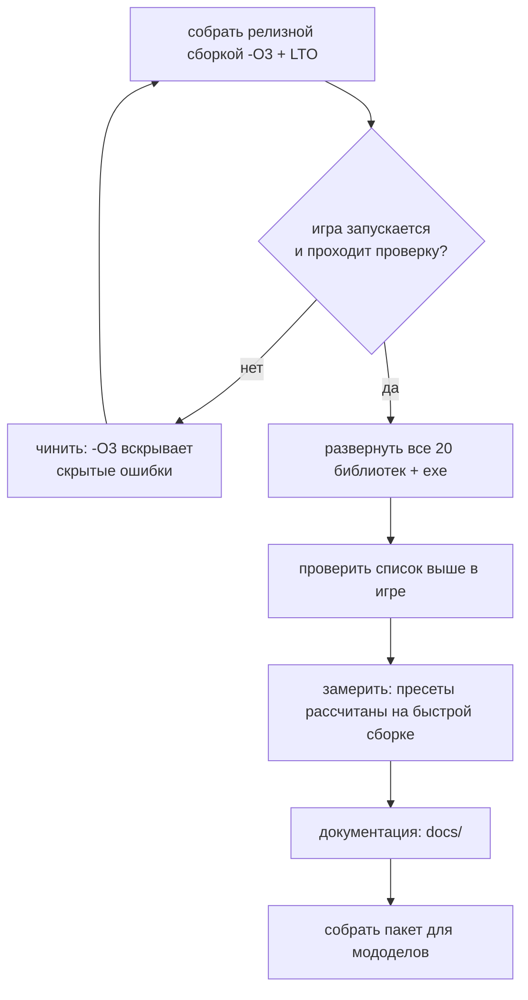

# Дорожная карта

Ориентир по релизу для мододелов — **10 августа**. Документ отражает состояние на 30 июля.

## Где мы сейчас

```mermaid
gantt
    dateFormat YYYY-MM-DD
    title Путь порта
    section Основание
    Разбор оригинала (декомпиляция, извлечение данных)  :done, a1, 2026-06-01, 2026-07-05
    Исходники DA от автора, дифф движка                 :done, a2, 2026-07-05, 2026-07-12
    section Перенос
    Правки движка из диффа                              :done, b1, 2026-07-12, 2026-07-20
    Инвентарь, детекторы, зоны, мутанты                 :done, b2, 2026-07-18, 2026-07-24
    section Картинка
    Отражения в воде, вид воды                          :done, c1, 2026-07-20, 2026-07-25
    Масштаб рендера, темпоральное сглаживание           :done, c2, 2026-07-24, 2026-07-26
    Векторы движения, FSR 2/3, XeSS                     :done, c3, 2026-07-25, 2026-07-27
    DLSS: прослойка MinGW, векторы мира                 :done, c4, 2026-07-28, 2026-07-29
    section Скорость
    Замеры кадра, потолок теней, поиск пути             :done, e1, 2026-07-27, 2026-07-28
    Меню производительности и пресеты                   :done, e2, 2026-07-28, 2026-07-28
    section Инструменты
    Авто-тесты Lua-скриптов                             :done, t1, 2026-07-29, 2026-07-29
    section Устойчивость
    Утечки памяти, семь штук                            :done, s1, 2026-07-29, 2026-07-30
    Падения загрузки, Windows 7, мерцание тени          :done, s2, 2026-07-29, 2026-07-30
    section Осталось
    Проверка в игре всего перенесённого                 :active, d1, 2026-07-26, 2026-08-03
    Сборка релиза и документация                        :d3, 2026-08-03, 2026-08-10
```

## Сделано

**Основание.** Оригинал разобран: движок декомпилирован (16 модулей, ~51 тысяча функций), данные
извлечены и разложены, распаковщик архивов написан. Затем автор мода передал исходники x64-альфы и
базы Call of Chernobyl — появился настоящий дифф движковых правок вместо чтения декомпилята.
Отчёт-карта: `_engine_diff/DA_ENGINE_CHANGES.md`.

**Перенос.** 1086 правок в 228 файлах — полный список в `02_PORT_CHANGES.md`. Крупное: слоты инвентаря
(рюкзак и граната), детекторы и счётчик Гейгера, зоны, снорк, защита костюмов и шлемов, торговля,
переносные источники света (все четыре, включая керосинку), звук, меню настроек, система состояния
актёра (выносливость, сытость, лечение, вес снаряжения), КПК (отношения и статистика), инвентарь.

**Картинка.** Экранные отражения в воде, вид воды доведён и принят, масштаб внутреннего рендера с
бикубическим апскейлом, темпоральное сглаживание, **векторы движения для всей геометрии** включая
скелетную анимацию, и на них — FSR 2, FSR 3, XeSS и **DLSS**. Подробности и ограничения:
`09_UPSCALERS.md`.

**Скорость.** Разобран кадр по фазам, найдены и закрыты три крупных источника тормозов: шторм поиска
пути у сталкеров (75 → 531 fps), отсутствие потолка теневых источников (в баре 9.65 → 3.75 мс),
дальность каскадов солнца (на Кордоне 130 → 240–500 fps). Сделаны вкладка «Производительность» и
общие пресеты. Цифры и метод: `04_PERFORMANCE.md`.

**Инструменты.** Быстрая сборка (6 с вместо 15 мин), собственные замеры кадра (`da_perf_dump`,
`da_gpu_log`, `da_render_log`), выгрузка интерфейсных файлов через ФС движка, переключатель сезонов.
С 29 июля — **авто-тесты Lua-скриптов** (`tests/run_tests.py`): разбор всех скриптов тем же LuaJIT,
что в движке, байтовая гигиена, вызовы `level.*` против биндингов порта, настройки без читателя,
unit-тесты на моках и главное — поиск глобалов, которые читаются, но нигде не присваиваются. Именно
эта проверка ловит класс дефекта, из-за которого предупреждения о выбросе молчали годами.

**Устойчивость (29–30 июля).** Отдельная волна работы, которая к переносу отношения не имеет, но без
неё выпускать было нельзя.

Закрыто **семь утечек памяти**, шесть из них — баги самого OpenXRay, а не порта: потерянный сетевой
пакет на каждое событие (это открытый баг upstream #2080), узлы `xr_fixed_map` в графе сцены рендера
(6 ГБ за десять минут игры — текла покадрово), граф ИИ уровня (15.6 МБ на каждую перезагрузку
сохранения), пути патрулей (там же было и двойное освобождение), буфер скриптового движка, объёмы
объёмного тумана и — самая крупная — представления текстур: **800 МБ памяти драйвера за каждую смену
уровня**. Последняя интересна методически: наши инструменты её не видели в принципе, потому что
объекты DirectX не живут в кучах Windows. Метод и цифры — в `07_TROUBLESHOOTING.md`.

Закрыты три падения: **не грузился ни один уровень с водой** (наш цикл экранных отражений
разворачивался компилятором и ронял сам `D3DCompile`, без стека и без сообщения); **Windows 7** — игра
не запускалась вовсе, а после починки падала на первом кадре меню, оба раза из-за кода, который
никогда не исполняется; и ловушка аллокатора, которая роняла игру сама, когда её забывали выключить.

Закрыто **мерцание тени** — последний незакрытый дефект картинки. Причиной оказалась наша же поправка
на джиттер, добавленная против него же днём раньше. Заодно сведены в один путь два способа выдавать
джиттер (из-за расхождения кадр ездил влево-вправо и на нашей темпоралке, и на FSR 3) и убрана дрожь
травы и листвы под апскейлерами — реактивность листвы была завышена на порядок.

## Осталось

### Обязательно до релиза

- **пересобрать пакет тестерам с картами линковки.** Три отчёта о вылете от 01.08 разобрать до имён
  функций **не удалось ни на одном кадре стека**: релиз собран с межмодульной оптимизацией, и она
  стирает привязку адреса к исходнику — `addr2line` отвечает `<artificial>` на любой адрес, а поиск по
  ближайшему символу выдаёт заведомо чужое имя (на вылет в интерфейсе назвал деструктор состояния
  псевдособаки). В сборку добавлена генерация `.map` на каждую библиотеку; карты кладутся рядом со
  сборкой, игроку не отдаются, и с ними чужой стек разбирается за минуту. **Без этого любой вылет у
  тестера остаётся нерасследуемым.**

| Задача | Почему | Риск |
|---|---|---|
| **Проверить в игре перенесённое** | часть правок из движкового диффа и игровых изменений не проверялась живьём | высокий: чинили вслепую |
| **Собрать релиз целиком с `-O3 + LTO`** | сейчас развёрнут смешанный набор: 6 перф-критичных библиотек релизные, остальные быстрые | средний: `-O3` может вскрыть скрытые ошибки |
| **Прогнать сохранения** | смена уровня и уход объектов в офлайн — оба краша реестра ALife чинились вслепую, гварды в игре не гонялись | средний |
| **Пересобрать пакет тестерам** | в `DeadAir_Tester` лежит сборка от 2:00 30 июля, то есть без падения на воде, без утечки представлений текстур и без починенного мерцания | высокий: у тестера не грузился бы ни один уровень с водой |

⚠️ Порядок здесь не произвольный. Пакет собирается **после** полного релизного прогона, потому что
сейчас в игре развёрнут смешанный набор библиотек, а частичное обновление уже давало падения в
неожиданных местах.

Список того, что надо потыкать руками (не проверено в игре):

**Сделано 29 июля, ни разу не игралось** — самое свежее и потому самое рискованное:

- **поломка креплений аддонов** (биты 28/29/30) — глушитель и подствольник не пристегнуть и не
  снять со сломанного крепления, пустое сломанное крепление уходит в «не носит такого». Проверять и
  на регресс: у исправного ствола ячейки аддонов должны остаться на месте;
- **заклинивший переводчик огня** (бит 27) — не переключается, и сама попытка переключения может его
  заклинить тем вероятнее, чем изношенней ствол.

**Перенесено раньше, живьём не игралось:**

- память неба, свет полтергейста, звуки усталости и попаданий, бег в
  прицеливании, звук двигателя;
- ~~защита от радиации после уменьшения в 10 раз~~ — ЗАКРЫТО 01.08, проверено замером в игре;
- капли на визоре в дождь;
- снорк: анимации и поведение;
- газ в лабораториях (X-18, X-8, X-16, warlab) — единственное место, где защита реально нагружена.

**Гварды реестра ALife — проверены и закрыты 29 июля.** Три смены уровня подряд без единого падения,
на двух из них гварды сработали и предотвратили ровно тот краш, что ронял игру 27 июля: члены
офлайновых отрядов (`sim_default_*`) регистрировались повторно сразу после `- Disconnect`. Каждый
объект зацепил **два** реестра — графовую точку и расписание, — и гвард расписания, поставленный
превентивно, оказался не перестраховкой. Загрузка квиксейва на 27 394 объекта тоже чиста.

**Проверено и закрыто:** фонарь, палочка, зажигалка, керосинка; граната в 14-м слоте и рюкзак в 15-м;
вес снаряжения; FSR 2, FSR 3 и DLSS в игре; потолок теневых ламп; **осечки оружия**, **счётчик
Гейгера** и **система состояния актёра** (сытость, бустеры, ожоги, раны — все шесть правок);
дрожь растительности, плетение детальной текстуры и мерцание земли; **динамическая музыка**;
кровотечение и выносливость (вес, шлем, бег, перегруз); **поломки оружия** — сами поломки, состояние
стволов у НПС после мародёрства и **поломки от стрельбы** (у автора блок закомментирован, в порте
оживлён за `g_weapon_malfunctions` и включён по умолчанию); отдача, разброс и урон по классам брони;
ближний бой;
**недельная инфляция цен у торговцев**; **поведение сталкеров и стелс**; **ремонт оружия и брони**; **обновление ассортимента у торговцев**; **радио и динамические новости**; **сон целиком** — спальник, покрывало у костра, отдых и смерть во сне от голода и от радиации;
**предупреждения о выбросе** (радиофразы и сирена — на Затоне, Юпитере и Агропроме; на остальных
уровнях тишина по данным мода) и **судьба NPC в выбросе и психошторме** — подтверждены 31 июля.

**Ориентир по времени.** До 10 августа остаётся около полутора недель. Движковая часть по существу
закрыта; всё оставшееся — это проверка руками, один полный релизный сборочный проход и упаковка.
Единственная работа, которая может ещё всплыть, — починка того, что вскроется на проверке.

### Желательно

- профиль Tracy на слабой машине;
- `profiler.script` на предмет скриптовых подтормаживаний;
- ~~батарейная фича~~ — **снята 31.07 решением автора.** Переносить `m_bUseEnergy` и `BATTERY_SLOT` не
  нужно: слот под батарею не требуется, `wpn_upd` лежит в инвентаре с начала игры. Ключ `use_energy` в
  данных мода не встречается ни разу, то есть гейт инертен и у автора. Проверено отдельно, что
  артефакты на поясе заряд батареи **не тратят** — они работают от собственного; разбор в
  `12_FAQ_ROADMAP.md`, раздел 4.

**Известных незакрытых визуальных дефектов не осталось.** Закрыты и подтверждены в игре: дрожь
растительности, плетение детальной текстуры под FSR 2 и мерцание земли под острым углом (последние два
лечит одна и та же настройка — `r__tf_aniso 16`; механизм и следствия для пресетов разобраны в
`09_UPSCALERS.md`, история замеров осталась в `10_DEBUG_DETAIL_WEAVE.md`). 30 июля к ним добавились
**мерцание тени** и **дрожь травы и листвы под апскейлерами**; первое ждёт подтверждения в игре после
релизной сборки, второе видно сразу.

### ✅ Кэш теневых карт — СДЕЛАНО

Смысл был — не ускорить то, что есть, а **вернуть тени лампам**. Реализовано: `light::da_smap_cache`,
постоянные слоты в `rt_da_smap_static`, отбор годности кадра (`da_smap_light_valid` — семь причин
отказа: выключено, поколение атласа, первый показ, время, место, лампа сдвинулась, ...), заполнение
(`da_smap_light_store`), консоль `r__smap_cache_lights` / `r__smap_cache_lights_ms` — код в
`r2_R_lights.cpp`. Раздел ниже оставлен как запись решения, не как открытая задача.

**Готового решения взять негде.** Проверено: у OpenXRay в истории такого нет; в движке Anomaly —
ровно та же архитектура X-Ray (`smap use/merge/finalclip`, тот же общий атлас), кэша нет, вместо него
ключи запуска на атлас побольше (`-smap2048`…`-smap4096`). Делать придётся самим.

**Что мешает сегодня.** Все карты живут в ОДНОМ атласе `rt_smap_depth` (2048×2048), который
переупаковывается каждый кадр с нуля: координаты тайла раздаются заново, размер зависит от расстояния
до камеры, а если лампы не влезли — атлас переписывается по нескольку раз за кадр (счётчик заходов
`smap_ID`). Сохранять там нечего.

**Первая очередь** (оценка — день с проверкой в игре):

1. постоянные слоты: массив карт вместо общего атласа. Для кэшируемых ламп хватит 1024×1024 — 2 МБ на
   слот, тридцать слотов ≈ 64 МБ видеопамяти;
2. раздача слотов с вытеснением по давности;
3. инвалидация: лампа сдвинулась или изменилась; внутри её радиуса шевельнулся динамический объект
   (спрос по сфере в пространственной базе дешёвый); загрузка уровня.

**Вторая очередь, по желанию.** На базе игрок ходит прямо под лампами, и наивная инвалидация будет
сбрасывать кэш почти у всех. Взрослое решение — разделить карту на **статическую** (кэш, только мир) и
**динамическую** (каждый кадр, только подвижное), а в шейдере брать ближайшее из двух. Это уже правка
выборки теней.

⚠️ Почему не до релиза: правка лезет в теневой конвейер, а он перестал преподносить сюрпризы только
01.08 (см. `[[light-shadow-budget]]`, две ошибки подряд в одном и том же месте).

### ✅ Кэш векторов травы — СДЕЛАНО (25.08, упрощённая версия)

Замерено в игре (`da_frame`, счётчик `dt_rend`): **0.58 → 0.42-0.45 мс** (−26%), весь `DA_RENDER
total` — 2.44 → 2.13-2.20 мс (−11.5%). DIP почти не изменился (2125→2121, те же сцены) — выигрыш
настоящий, не эффект другой точки на карте.

Реализовано ПРОЩЕ, чем план ниже: не `StructuredBuffer` и не правка шейдеров, а кэш на CPU-стороне.
У `SlotItem` (`DetailManager.h`) добавлены `cached_out[4]` и `cache_valid` — `hw_Render_dump`
(`dx11DetailManager_VS.cpp`) теперь копирует готовые 4 вектора вместо пересчёта `M*scale` на каждый
куст каждый кадр, инвалидируя кэш ровно там, где `UpdateVisibleM` меняет `scale_calculated`
(`DetailManager.cpp`, раз в 15-30 кадров НА СЛОТ, не на кадр). `mRotY`/`c_hemi`/`c_sun` не меняются
вообще после распаковки слота (`DetailManager_Decompress.cpp`) — их и не трогали.

Раздел ниже — исходный план (буфер на видеокарте) — оставлен как справка: он остаётся верным
направлением, если понадобится убрать САМУ копию в константный буфер (сейчас ещё копируется каждый
кадр, просто без пересчёта), но сегодняшнего выигрыша хватило без него.

### Вторая задача после релиза: постоянный буфер травы (план, не понадобился целиком)

Смысл — убрать цену подачи травы (0.58 мс/кадр, см. `[[grass-submission-cost]]`), не трогая
геометрию и не завися от исходников уровня. Ловушка прошлого захода: пытались лечить укрупнением
пачек (`hw_BatchSize` 61 → 256) — дало 0.04 мс вместо ожидаемых 0.45, потому что
`dx11ConstantBuffer::Flush` копирует **весь** буфер на каждую пачку (`memcmp` + `Map(DISCARD)` +
`CopyMemory`), и произведение «пачек × размер» не меняется. Это тупик, не повторять.

**Настоящая причина цены** — не отрисовка, а `hw_Render_dump`
(`Layers/xrRenderDX11/dx11DetailManager_VS.cpp`): на каждый из ~47 тысяч экземпляров травы **каждый
кадр** заново строятся 4 вектора (3 строки матрицы поворота × масштаб + цвет) и заливаются в
константный буфер. Трава при этом не двигается — раскачивание считает шейдер сам по времени и ветру
(`o.velocity`/`wind`, отдельно от матрицы), а сама матрица и масштаб куста меняются только когда
игрок переходит в новый квадрат кэша слотов (`DetailSlot`/`dtSlots`, `DetailManager.cpp`).

**Как делать правильно:**

1. Завести постоянный буфер экземпляров на видеокарте — `StructuredBuffer`, а не константный буфер
   (гибче по размеру, не упирается в лимит регистров DX9-эпохи, из-за которого и была пачка в 61).
2. Строить в него матрицы **не в `hw_Render_dump` на каждый кадр**, а в момент обновления кэша
   слотов — там же, где сейчас пересчитывается видимый набор `DetailSlot` при переходе игрока между
   квадратами. Кадр должен только рисовать (индексироваться в буфер), а не пересобирать данные.
3. `hw_Render_dump` в этой схеме — это `RenderInstanced` по готовому диапазону в буфере, без цикла
   `for (SlotItem* item : *items)` с матричной алгеброй внутри.
4. Дешёвый рычаг оставить как есть — `ps_r__detail_radius` (49..300, `xrRender_console.cpp`): число
   экземпляров падает линейно, это уже работает и не требует правки.

**Уточнение (25.08).** Проверили отдельно: можно ли просто увеличить размер пачки, чтобы засунуть
все ~47 тысяч экземпляров в один заход? Технически да — нынешний потолок `hw_BatchSize` зажат в 64
формулой из эпохи DX9 (`(HW.Caps.geometry.dwRegisters - c_hdr) / c_size`, регистры вершинного шейдера,
которых на DX11 в этом смысле давно нет), а у `StructuredBuffer` такого потолка нет вовсе — 47 000
экземпляров это ≈3 МБ, тривиально для видеопамяти. **Но замер это уже опроверг**: пачку 61 → 256 уже
поднимали, вызовов стало в 3.5 раза меньше, а выигрыш — 0.04 мс вместо ожидаемых 0.45 (см.
`[[grass-submission-cost]]`, таблица). Дорого не число вызовов отрисовки, а сама запись 47 тысяч
матриц **каждый кадр**. Больший буфер полезен только как хранилище для пункта 1 выше (готовые
матрицы, не пересобираемые каждый кадр), сам по себе — нет.

⚠️ Почему не до релиза: правка меняет владение данными между кадром и логикой кэша слотов, риск
регресса — мигание/рывок травы при переходе между квадратами, если инвалидация неполная. Проверять
нужно живой игрой (обход локаций на границах квадратов), стенд эту фазу не считает.

⚠️ Это не тот же вопрос, что «где взять исходники геометрии травы» — тот случай (модели в
`level.details`) остаётся заблокирован отсутствием SDK-исходников уровней. Инстансинг работает на
любой геометрии, какая уже загружена, и от источника контента не зависит вообще.

### 🧭 Куда идти дальше по скорости: карта, снятая замером (25.08)

Кадр в этой сцене: **процессор 4.59 мс, видеокарта 3.46** — то есть кадр УПИРАЕТСЯ В ПРОЦЕССОР, и
экономия на видеокарте сейчас не даёт ни одного кадра в секунду. Это первое, что надо проверять
перед любой правкой: сегодня оно уже уберегло от вечера работы впустую (см. каскады ниже).

**Процессор по фазам** (`da_frame`, строка `[DA_GPU]`, первое число пары):

| фаза | процессор | видеокарта |
|---|---|---|
| **lights** | **1.58** | 0.14 |
| gbuffer | 0.72 | 0.93 |
| combine | 0.31 | 0.79 |
| **sun_smap** | 0.06 | **1.52** |
| forward / sorted / gbuffer2 | 0.16 / 0.10 / 0.07 | ~0 |
| prepare, wait_cull, wait_fence | 0.00 | — |

⭐ Главная цель процессора — **фаза света (1.58 мс)**. Её состав (`da_light_prof`):

```
ожидание списков 0.38 | накопление 0.36 | теневые карты 0.27 | раскладка атласа 0.10
выборка динамики 0.02 | видимость ламп 0.03
волн 31, нехваток 30, свободно контекстов 4, обходов 122 (из них пустых 33)
```

**Ожидание — это нехватка контекстов отрисовки: 122 обхода на 4 контекста.** Лечится увеличением
`R__NUM_AUX_CONTEXTS` (`xrEngine/Engine.h`), оба пула масштабируются от макроса сами. Ожидаемо
~0.19 мс при восьми контекстах.

⚠️ **Почему не сделано сейчас:** макрос задаёт размер `marker[R__NUM_CONTEXTS]` в `vis_data`
(`xrEngine/vis_common.h`), а эта структура лежит внутри КАЖДОГО визуала и ходит между библиотеками
рендера и игры. То есть это правка общего заголовка: нужна пересборка всего и выкладка всех
библиотек, а развёрнут смешанный набор (шесть релизных + остальные быстрые). Честный замер требует
полной релизной сборки — **делать вместе со следующим релизным прогоном**, правка на одну строку.

**⛔ Каскады солнца — проверено и отложено с обоснованием.** Дублирование реально: каскады вложены
(20/40/160 м), и объекты ближнего рисуются в дальние тоже — 82 / 199 / 655 объектов по каскадам,
лишних около 280 из 936 (~30%). Приём известен (отсечение отбрасывающих тень, Bittner et al.). НО:
каскады стоят 0.21 мс процессора и 1.52 мс видеокарты, то есть экономия почти вся на видеокарте — а
кадр упирается в процессор. Браться имеет смысл только после того, как процессор опустится ниже
видеокарты.

**Прибор оставлен:** `r__graph_prof 1` раскладывает цикл отрисовки графа (сортировки, настройка
прохода с разбивкой до `set_Constants`, отрисовка, динамика) и печатает разбивку ПО КОНТЕКСТАМ —
0..2 каскады солнца, 3 вспомогательный, 4 основная сцена. В нуле стоит одну проверку int.

### ⛔ Выборка вершин из шейдера (vertex pulling) — СДЕЛАНО, ЗАМЕРЕНО, ОТВЕРГНУТО (25.08)

Доведено до рабочего состояния (картинка проверена в игре — неотличима) и откачено по замеру.
Раздел оставлен, чтобы это не начали заново.

**Замер, одна сцена, игрок на месте, `da_frame 10`:**

| | DIP | вершин | треугольников | render |
|---|---|---|---|---|
| выключено | 1850 | 856 тыс | 674 тыс | **4.25 мс** |
| включено | **1432** | 1251 тыс | 674 тыс | **6.20 мс** |

Вызовов на 418 меньше (−23%), кадр на 46% МЕДЛЕННЕЕ.

**Почему не окупается — две причины, первая неустранима в рамках приёма:**

1. ⭐ **Теряется кэш преобразованных вершин.** При индексированной отрисовке вершина, общая для
   нескольких треугольников, преобразуется ОДИН раз — видеокарта её кэширует. При выборке из шейдера
   каждый индекс это отдельный запуск вершинного шейдера, переиспользования нет: те же 674 тысячи
   треугольников стоили 1251 тысячу вершинных запусков вместо 856. Это свойство схемы, не недосмотр.
2. Сборка пачек на процессоре стоит дороже сэкономленного: `prim` вырос 1.73 → 2.51 мс. Кэширование
   группировки между кадрами вернуло бы часть, но пункт 1 остаётся.

**⭐ Главное, что доказал этот замер: кадр НЕ упирается в число вызовов отрисовки.** Убрали 418
вызовов — стало хуже. Прежний вывод «render самая тяжёлая строка, значит дело в вызовах» неверен, а
на нём стояли и остальные попытки того дня (инстансинг статики дважды, слияние по диапазону,
сортировка по состоянию) — все дали ноль или минус.

**Варианта «сделать правильнее» нет.** Сохранить кэш вершин и одновременно слить РАЗНЫЕ меши в один
вызов невозможно: либо индексированная отрисовка с переиспользованием, либо слияние. Классический
инстансинг это обходит (один меш много раз), но повторов у нас почти нет — измерено дважды.

**Что осталось от работы полезного:**

- диагностика форматов вершин на загрузке (`r2_loader.cpp`, оставлена): 39 буферов, 3 формата, все по
  32 байта, первые 24 байта одинаковы; теневой поток — 1 формат по 12 байт;
- ⭐ у статики мировая матрица ЕДИНИЧНАЯ (`set_xform_world(Fidentity)` один раз на проход, координаты
  запечены в вершины) — пригодится любому будущему разбору;
- потолок слияния, если понадобится: 313 проходов при 20 шейдерах, разницу дают РАЗНЫЕ НАБОРЫ ТЕКСТУР
  на одном шейдере (`deffer_base_lmh_steep_db-hq`: 150 проходов на 303 объекта).

**🪤 Два молчаливых отказа по дороге** (стоят запоминания): не вызванный `set_Geometry` — падение с
разыменованием нуля в `ApplyVertexLayout`, потому что в релизе `VERIFY(decl)` вырезан; и подмена
полей уже распакованными — «бампованный» шейдер распаковывает `Nh/T/B` сильно позже «плоского», и
вторая распаковка вернула бы исходный порядок, уронив базис нормалей без единого сообщения.

### Кандидат (не измерено): та же болезнь у деревьев

Проверка кода травы дала повод посмотреть рядом — деревья (`FTreeVisual.cpp`) уже инстансятся у нас
(пачками до 64, комментарий `[DA_PORT] Пакетная отрисовка деревьев`), и на первый взгляд там всё в
порядке. Но `FillInstanceData` пишет **9 векторов на дерево** (мировая матрица + матрица `мир×вид` +
масштаб/смещение/солнце), и вот это конкретное место подозрительно:

```cpp
Fmatrix xform_v;
xform_v.mul_43(cmd_list.get_xform_view(), xform);   // FTreeVisual::FillInstanceData
```

`get_xform_view()` — матрица камеры, она **одна на весь кадр**, а не своя у каждого дерева. Но
перемножение `вид × мировая` всё равно делается на CPU для каждого дерева отдельно, хотя честно
зависит от камеры только множитель, а `xform` (мировая матрица) у дерева не меняется вообще —
дерево не двигается, в отличие от травы, у которой хотя бы кэш слотов раз в переход. На Юпитере,
судя по собственному комментарию в коде, деревья — «самая длинная череда однотипных вызовов за
кадр».

**Что тут можно сделать, если замер подтвердит цену:**

1. Не перемножать `вид × мир` на CPU вовсе — отдавать в шейдер мировую матрицу как есть (она
   статична, кэшируема) и вид как один общий константный буфер на кадр; перемножение уйдёт в
   вершинный шейдер, где оно и так одно на вершину, а не одно на CPU-инстанс.
2. Тогда единственное, что нужно строить на CPU — это набор видимых деревьев (уже есть, отбор для
   пачки), а не их матрицы: сами матрицы кэшируются один раз при загрузке уровня.

⚠️ **Это неизмеренная гипотеза, не подтверждённая находка.** В отличие от травы (0.58 мс, замерено
`da_gpu_log`/`gbuffer2`), для деревьев цифр нет — возможно, счёт деревьев в кадре мал настолько, что
экономить нечего. Прежде чем трогать код, нужен тот же замер, что был для травы: изолировать фазу
инстансинга деревьев и посмотреть, сколько она стоит именно на Юпитере (самая частая по стволам
локация).

### Сознательно отложено

- **рефракция воды** — требует переделки того, как вода накладывается на сцену; предложена и отклонена;
- **расширение многопоточности** — риск гонок данных у игроков перевешивает выигрыш до релиза;
Сериализация маски поломок оружия отсюда **убрана: сделана и подтверждена в игре.** Прогноз «починка
сломает сейвы» оказался неверным — в движке есть штатный механизм версий (`m_wVersion`), поэтому
поле закрыто условием `m_wVersion > 128`, а `SPAWN_VERSION` поднят до 129. Старые сохранения читаются.

## Как выпускать



⚠️ На выпуск идёт **целиком релизная** сборка — это единственный момент, когда наборы не смешиваются.
Пресеты производительности калибровались на смешанном наборе, так что после полного релиза их стоит
перепроверить: числа могут сдвинуться в лучшую сторону.

**Про развёртывание:** правка общего заголовка требует пересборки всего и копирования **всех**
библиотек. Частичное обновление даёт падения в неожиданных местах, потому что часть модулей остаётся
со старым представлением о размере класса. Это уже случалось.
