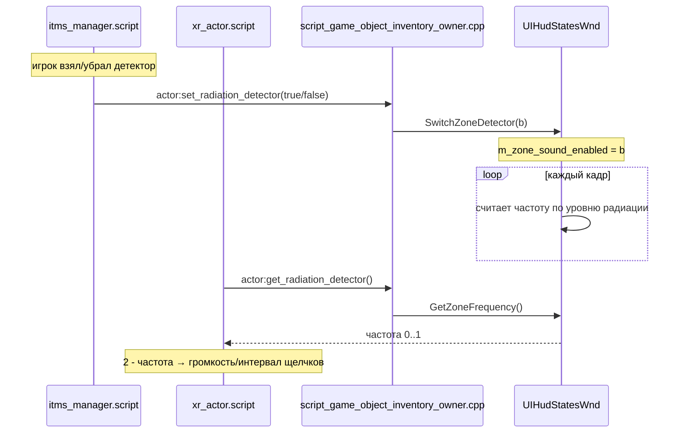
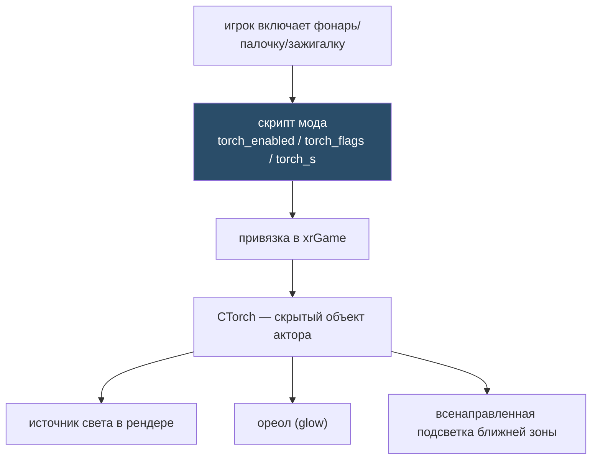
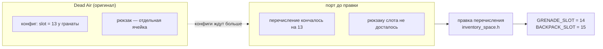
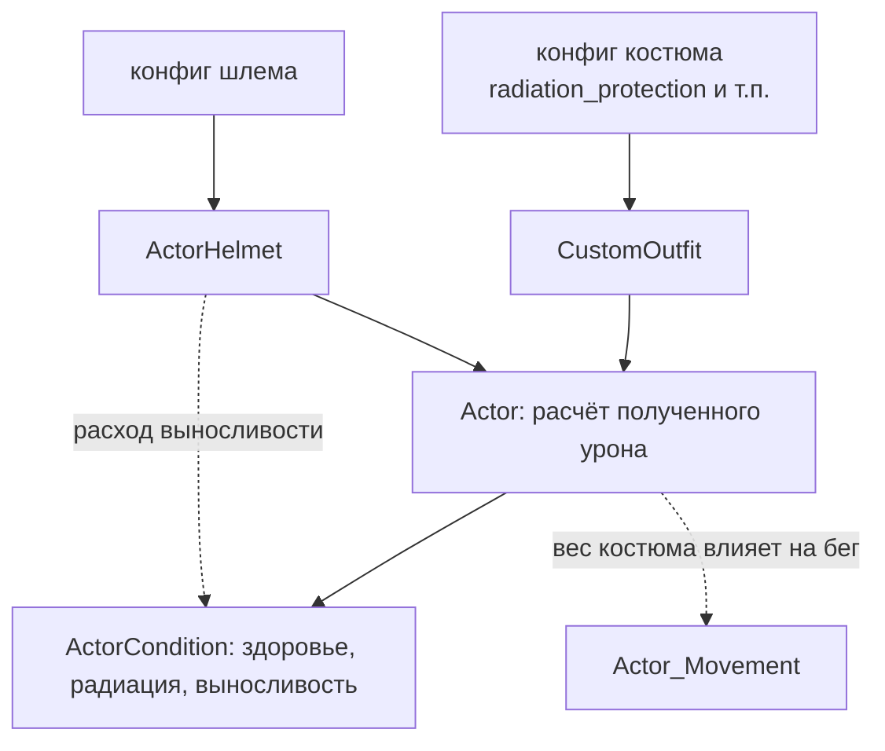
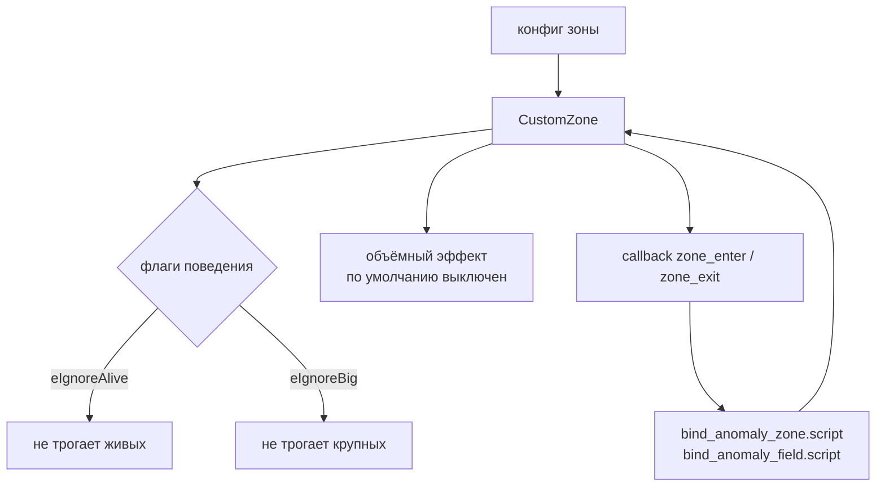
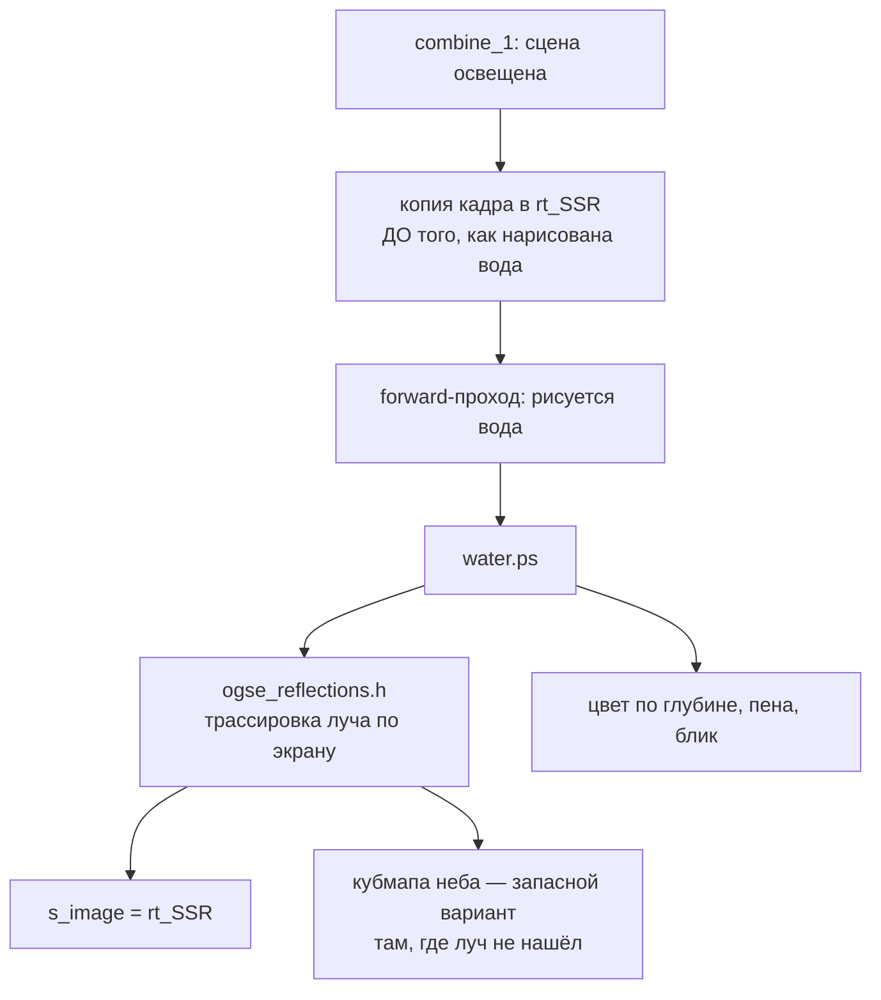
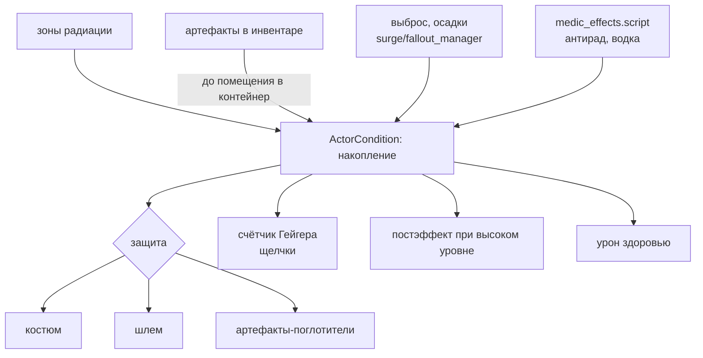
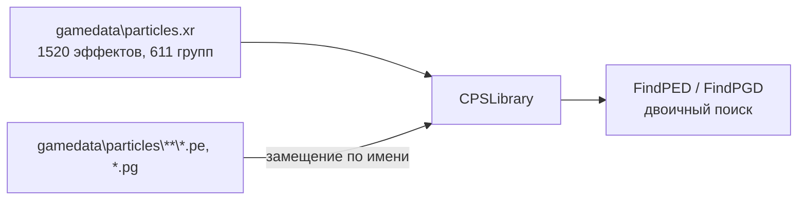

# Схемы фич: как логика проходит сквозь скрипты и движок

Разобраны те фичи Dead Air, которые пришлось чинить при портировании — то есть те, где связь
«скрипт ↔ движок» реально проверена, а не восстановлена по догадке. Каждая схема идёт от того, что
пишет автор мода в Lua, до того, что в итоге исполняет C++.

Общий приём поиска — в [03_LUA_MAP.md](03_LUA_MAP.md), здесь конкретика.

---

## Счётчик Гейгера

Классический пример «фича живёт в трёх слоях сразу»: предмет в инвентаре, метод объекта, окно HUD.



**Что было сломано:** в порте методов не существовало вовсе — скрипт вызывал их, получал ошибку, и
счётчик молчал всегда. Добавлены `SetRadiationDetector` / `GetRadiationDetector` и пара
`SwitchZoneDetector` / `GetZoneFrequency` в окне состояния HUD.

**Где смотреть:** `script_game_object_inventory_owner.cpp:2254` и `:2304`, `ui/UIHudStatesWnd.*`.

---

## Переносные источники света

Самая неочевидная схема: у актора есть **скрытый** фонарь, которым скрипты управляют дистанционно.
Палочка и зажигалка — не отдельные источники, а режимы этого же объекта (керосинка устроена иначе, см. ниже).



**Что было сломано:** методы управления существовали, но были **заглушками** — скрипт отрабатывал,
свет не появлялся. Это тот самый случай «метод есть, логики нет», который не даёт ни ошибки, ни
эффекта.

**Керосиновая лампа устроена иначе** и сделана отдельно. Это секция `device_kerosinka` (не путать с
`kerosene` — то топливо для готовки), и светит она **лёжа на земле**, а не в руках: у неё свои
`light_*` параметры, мировой источник света и пламя, плюс режим «Установить» с призраком-макетом.
Реализовано в `CCustomDetector`, потому что мировой детектор штатно света не рисует вообще.

---

## Слоты инвентаря: рюкзак и граната

Пример фичи, которая ломается не логикой, а **числом**.



**Суть:** конфиги мода (данные, которые мы не трогаем) ссылались на слот, которого в движке порта
просто не было. Никакой ошибки при этом не возникает — предмет молча не надевается.

Нумерация сдвинута: конфигурационный слот 13 у гранаты соответствует движковому `GRENADE_SLOT = 14`.
Стоковый гранатный слот CoP под номером 4 данные DA не используют — он оставлен на месте, чтобы не
поехала нумерация и старые сохранения.

**Урок:** когда предмет «не надевается без причины», сначала сверить число слотов в
`xrServerEntities/inventory_space.h` с тем, что ждут конфиги.

---

## Защита костюма и шлема



**Что правилось:** коэффициент защиты — сток душил всю небронебойную защиту множителем **0.1**, а DA
балансировал под полную, поэтому в порте он равен 1.0. Проверять надо **оба файла**, `CustomOutfit.cpp`
и `ActorHelmet.cpp`: правка в одном лечит половину симптома и выглядит как «стало лучше, но не до
конца».

⚠️ **Шлем на выносливость НЕ влияет, и это осознанно.** У автора расход считается суммой
`0.5 + костюм + шлем + рюкзак`, но шлемы DA ключ `power_loss` не задают ни разу, а поле по умолчанию
равно 1.0 — то есть в его собственной сборке любой шлем добавлял +100%. Порт оставил стоковый
**множитель**: конфиги написаны именно под него (костюм 0.62 читается как «спринт стоит 62%»,
а апгрейды из этого числа вычитают). Замер: с суммой 85 секунд спринта превращались в 12.

⚠️ **Два семейства ключей делают разное, их легко перепутать:** `*_protection` в секции костюма
вычитается из урона игроку, а `*_immunity` в секции иммунитетов управляет **скоростью износа самого
костюма** по типам урона.

Разбор всей системы состояния актёра — в памяти проекта; шесть правок перенесены и трижды сверены по
коду, но **живьём не игрались**.

---

## Зоны (аномалии)



Флаги игнорирования — добавка Dead Air: в базовом движке их нет, а конфиги мода на них рассчитывают.
Значения по умолчанию для объёмных эффектов выставлены в коде, чтобы конфиги без этих ключей вели
себя как в оригинале.

---

## Вода: отражения

Единственная фича в этом списке, которая целиком живёт в рендере, без Lua.



**Почему копия обязательна:** вода рисуется прямо в тот же буфер, который она должна отражать, а
читать буфер, привязанный на запись, нельзя. Без копии в слоте остаётся текстура прошлого прохода —
буфер нормалей, и отражения выходят неоново-зелёными.

---

## Радиация: полная цепочка

Сводная схема, потому что радиация в Dead Air затрагивает почти все слои.



**Артефакты облучают** из любого места инвентаря, пока не помещены в контейнер — решение принято и
проверено в игре. Механика целиком в скриптах (`inventory_radiation.script` обходит весь инвентарь;
упакованный артефакт меняет класс на `S_PDA` и перестаёт подходить под проверку), движок её только
не должен дублировать.

---

## Частицы россыпью: правка эффектов без пересборки архива

Все эффекты игры лежат одним файлом `gamedata\particles.xr` — 1520 эффектов и 611 групп. Раньше
правка любой мелочи требовала пересобрать его целиком, инструмента для этого у мододела нет, и
внешний вид аномалий считался неприкасаемым.

Чтение по одному файлу в движке было написано изначально (`CPEDef::Load2` / `CPGDef::Load2`), но
вызывалось только из редакторской сборки. В порте тот же код работает и в игре: после разбора
архива просматривается каталог `gamedata\particles`, и каждый найденный `*.pe` (эффект) или `*.pg`
(группа) **замещает** одноимённый из архива либо добавляется как новый.



**Имя эффекта — это путь файла без расширения**, относительно `gamedata\particles`. То есть

    gamedata\particles\anomaly2\studen_idle_bottom.pg   →   "anomaly2\studen_idle_bottom"

Раскладка на диске обязана повторять имена из архива, иначе получится не подмена, а новый эффект.
В логе результат виден строкой `[DA_PORT] Частицы россыпью: ...` — сколько заменено, добавлено и
не разобрано. Если каталога нет, движок молчит и ведёт себя как раньше.

Порядок в массивах важен: поиск эффекта в игровой сборке идёт **двоичным** поиском, поэтому после
добавления новых записей список пересортировывается. Замены порядок сохраняют.

### Чем готовить файлы

Группы (`.pg`) — простой ini, их можно выгружать из архива и править текстом:

```
python da_port/tools/export_particle_group.py "anomaly2\studen_idle_bottom" <куда.pg>
python da_port/tools/export_particle_group.py "anomaly2\studen_blowout" <куда.pg> --drop distort
```

`--drop` убирает из группы записи по подстроке имени — так снимается лишнее, не трогая сами
эффекты. Посмотреть, что вообще есть в архиве и сколько где частиц:

```
python da_port/tools/dump_particles.py <particles.xr> <отчёт.txt> [ключ ...]
```

Эффекты (`.pe`) содержат ещё и список действий частицы, руками их писать неудобно — их выгружает
редактор частиц из SDK. Но для оптимизации внешнего вида этого обычно и не нужно: **что именно
играет, задаёт группа**, а значит лишний слой снимается правкой `.pg`.

### Что это даёт на практике

Разбор химической аномалии (`zone_mine_chemical_*`, группа `anomaly2\studen_idle_bottom`): 63
частицы покоя, из них **28 — искажение** (`pfx_distortion` и `pfx_dist2`). Само число частиц
ничтожно, а вот искажение гонит отдельный проход преломления и стоит по площади на экране. Снять
его — правка одного `.pg`, обратимая удалением файла.

---

## Как добавлять новые схемы

Порядок, которым получены все схемы выше:

1. найти вызов в скриптах: `grep -rn "имя_метода" "Dead Air/appdata/logs/vfs_scripts"`;
2. найти привязку: `grep -rn "ИмяМетода" xray-16/src/xrGame/*_script*.cpp`;
3. перейти к реализации и посмотреть, что она делает **на самом деле** — заглушка это или логика;
4. если логики нет, сверить с `_engine_diff/` — как было в оригинале.

Не описывать схему по названиям функций: половина ловушек этого проекта в том, что имя есть, а тела
за ним нет.
